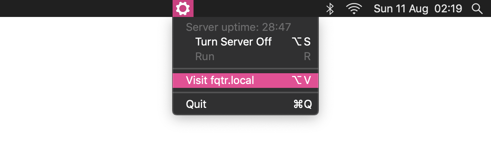

<h1 align="center">
  LocalSwitch 
</h1>

<blockquote align="center">
  <p><b>
    Menu bar interface for a local Apache <code>httpd</code> server.
  </b></p>
</blockquote>

<br>

<a align="right" href="//github.com/DaFuqtor/LocalSwitch/releases"></a>

<a align="left" href="//app.bitrise.io/app/29073ae90a8359bb"></a>

<p align="center">LocalSwitch is an open source macOS interface for <code>apachectl</code> written in Swift.</p>



<h2 align="center">
  <a href="//github.com/DaFuqtor/LocalSwitch/releases/latest/download/LocalSwitch.zip">
    Download latest release &nbsp
    <a href="//github.com/DaFuqtor/LocalSwitch/releases/latest">
      
    </a>
  </a>
</h2>

### [Homebrew Cask](//brew.sh) (Recommended)

```powershell
brew cask install dafuqtor/tap/localswitch
```

### Quick Installation

> This script just downloads LocalSwitch to the `Applications` folder. Additionaly, you **lose** auto-updates.

```powershell
curl -sL git.io/localswitchinst | sh
```
